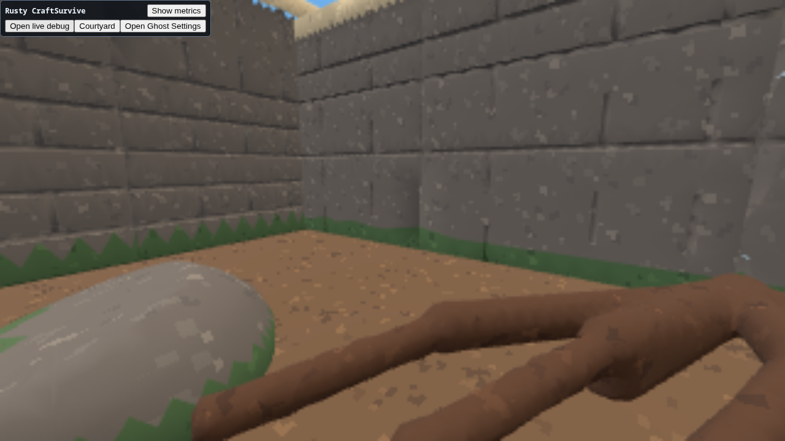
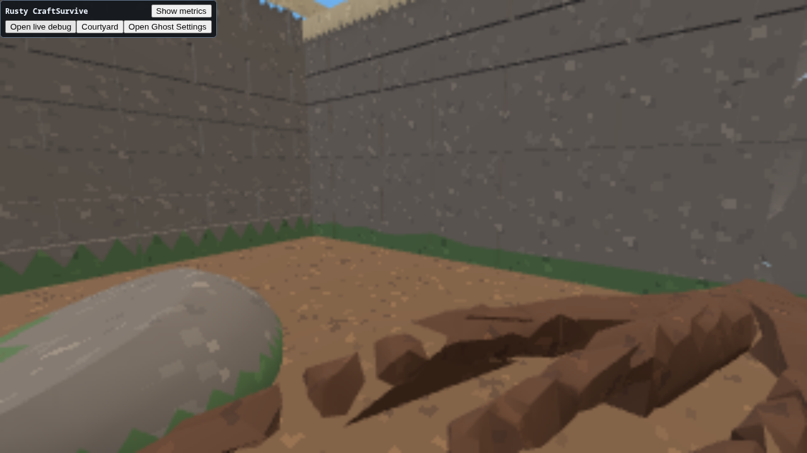
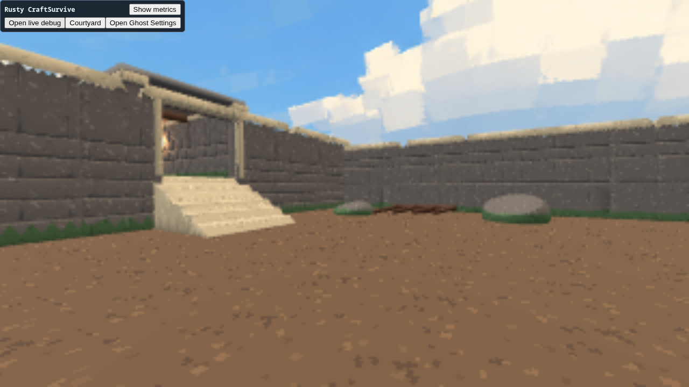
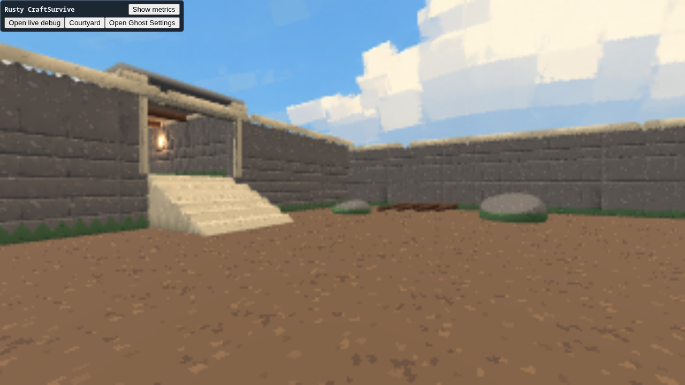
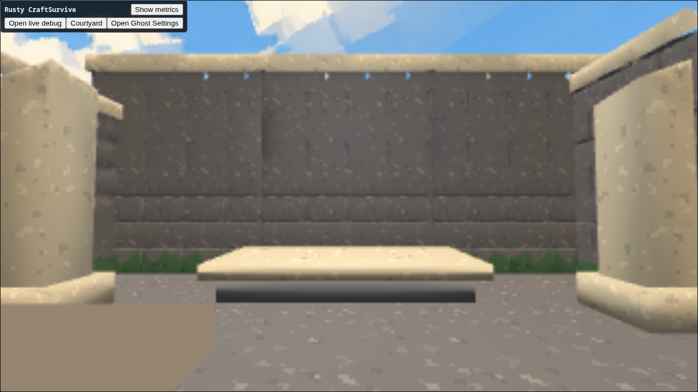

# Courtyard experiment result

The development result is useful: one ordinary C# recipe builds and regenerates
an interconnected courtyard, six steps, covered passage and chamber through
Engine-owned implicit fields, meshing, retained rendering and copied mesh
collision. No offline prefab variants, mesh joins or per-piece texture bake are
needed. The aesthetic result is promising retro 3D, but still a rough environment
study rather than a finished pixel-art direction.

## Selected treatment

**Soft** is the default: requested cell size 0.20m, crease threshold 110°,
world-space UV scale 0.6 repeats/m, five nearest/repeat 32×32 textures, cool
ambient and warm directional light with contrasting passage/chamber lights.
Sampling and texture scale are independent. These are CraftSurvive choices;
Engine exposes general field and surface controls without retro presets.

Soft makes the masonry courses and portal recesses legible and keeps the roots
from reading as unrelated triangular cuts. Balanced and Faceted remain available
in the Courtyard panel for direct comparison. A separate Luna critic preferred
Balanced's angular root planes; the owner judgment favors Soft's scene-wide
material readability. The difference is most obvious close up, not in the wide
silhouette. No claim is made that smooth DC is inherently the correct art method.

| Treatment | Requested cell / crease | Scene triangles | Seam-split vertices | Observed build time |
| --- | --- | ---: | ---: | ---: |
| Balanced | 0.22m / 38° | 205,336 | 177,393 | 0.737s |
| Faceted | 0.26m / 0° | 199,924 | 337,327 | 0.658–0.680s |
| Soft | 0.20m / 110° | 211,468 | 149,370 | 0.603–0.610s |

These are single-run observations, not benchmark averages. The product stopwatch
covers field construction, generation, appearance creation and collision
replacement; worker serialization and browser realization happen afterward.
Sampling is rounded to an octree depth per bounded piece, so requested cell size
is not a direct triangle-count knob. Flat shading splits more vertices.

Matched detail views:

| Soft | Balanced | Faceted |
| --- | --- | --- |
|  |  |  |

The screenshots came from SwiftShader at 320×180 backing for 1280×720 CSS. That
is the Engine's software-renderer safety ceiling, not an authored pixelation
setting. Hardware rendering and comfortable game-speed pacing remain unverified.
Observed software submissions were roughly 2.6–3.6Hz with ~35–63ms completion
samples in different views; submission rate is not an FPS benchmark. The wide
views reported 153 draw calls, 68 resident geometries, 272 materials and nine
textures (six defined). The retained hidden legacy ghost/microvoxel fixture
accounts for much of the material count. There were no material fallbacks.
Raw observations are under `docs/evidence/courtyard/`; the Soft renderer snapshot
is a close view, so its lower drawn triangle count is not a fair wide-view speed
comparison.

## Authoring test

From the default scene, run these ordinary live debug commands:

```text
craft.courtyard.treatment soft
craft.courtyard.layout 26 3.8 0.25 12345
craft.courtyard.readout
```

This changes courtyard width 24→26m, doorway width 3.4→3.8m, doorway center
0→0.25m and the keyed chip seed. Generation 4 completed in 0.627s: 67 parts,
216,176 triangles and 153,052 vertices. The wider scene needs two extra wall
sections. Door frames and openings move together, courses retain their phase,
and collision is replaced from the generated meshes. No source edit, hand mesh
repair, alternative prefab selection or texture bake was needed. The dimensions
are intentionally bounded; this is a small recipe, not a level-editor framework.

| Default | Regenerated layout |
| --- | --- |
|  |  |

A focused canvas click followed by physical W-only input crossed the visible
bevelled steps, the passage and the changed chamber. The recorded Soft player center
reached z=24.802m with feet about y=5.015m, grounded. The same route also passed with Balanced (generation 5, z=23.285m). No jump,
hidden ramp or camera teleport supplied either traversal. Controlled camera positioning was used
separately for the matched aesthetic screenshots.



## Costs and remaining weaknesses

- Large uninterrupted walls and uniform speckle still read as a sparse test
  environment. Texture clusters need stronger intentional shapes and hierarchy.
  The next bounded art pass should use fewer, larger value clusters and a few
  authored edge accents, keeping this geometry/authoring path stable.
- Triangle-centroid moss boundaries produce visible sawtooth bands. Thin sampled
  cap/relief features show pinholes or irregular edges in places. These are
  visible limitations, not intentional pixel-art marks or a watertight mesh
  guarantee. Avoid relying on details smaller than the sampling scale.
- A discarded 0.16m Balanced preset produced 678,764 triangles/494,540 vertices.
  It started successfully, but replacing a softer scene with it exceeded the
  host's five-second operation deadline despite ~1.4–1.7s generation. Engine
  #7833 owns the long-operation/publication issue. The shipped Balanced preset
  was reduced to 0.22m; its return from Soft completed at generation 5.
- Engine #7831 tracks auto-step rejection at hard vertical mesh risers. These
  stairs have visible 45° bevelled noses and use exactly that mesh for collision.
  This product choice does not claim to repair the general solver limitation.
- Generation is synchronous and deliberately pauses for explicit rebuilds.
  No seamless mutation, background streaming, peak-memory deadline guarantee,
  complete mesh topology repair or texture baking is claimed.

## Evidence and ownership

Engine pair: `0.1.0-dev.b9740421c2d2`, source
`b9740421c2d266f34416234a6021511a0821360f`. This exact SDK and runtime pack are
selected by the C# project and both serve manifests. Field/kernel, surface
attributes, generated bindings, copied collision, committed-baseline transport
and their focused tests were reviewed under Engine #7825–#7827.

The comparison and authoring session index is
`/home/agent/.codex/playtester/runs/rusty-craftsurvive/rusty-craftsurvive-playtest-20260906T060738.881326623Z-475237/playtest-index.json`.
Screenshots 0002/0004–0009 are the comparisons; 0012/0013 are the focused physical
walk. 0003 was obscured by debug UI, 0010/0011 had no canvas focus, and the session
contains the discarded dense-preset timeout. Those attempts are retained and are
not clean acceptance evidence. Selected raw screenshots/readouts are copied here
for a durable record. Final serving and warning-capture evidence is recorded below.

Fresh final session:
`/home/agent/.codex/playtester/runs/rusty-craftsurvive/rusty-craftsurvive-playtest-20260906T062305.325709916Z-475237/playtest-index.json`.
At committed Craft `8b7cb530c07e1be9acf1e9bffdf0433a757f338e`, Soft → Faceted →
Balanced → Soft completed generations 1–4 in the same product runtime, with
reported build times 0.590/0.713/0.626/0.624s. The Courtyard Refresh control
visibly read generation 4. Physical W-only movement reached z=24.803m, grounded,
through the default steps and passage into the chamber (screenshots 0002/0003).
The optional metrics toggle was not exercised in that session.

The full fresh Engine diagnostic read had zero errors, four dropped *timing
sample* observations and two degraded browser-baseline transitions, followed by
ready/baseline-established recovery on a replacement attachment in the same
runtime. These are nonfatal publication-pressure limitations owned by Engine
#7833; timing-sample drops are distinct from lost diagnostic-cursor capture.
No product-state reset occurred in this bounded roundtrip.

The Engine `capture-playtest-warning-delta.mjs` run completed browser and Engine
capture at cursor 8→8 with no dropped/lagged capture and no new Engine events in
its post-walk window. It recorded one Chromium GL performance warning, “GPU stall
due to ReadPixels.” The playtest also retained GL driver performance messages;
these are not page exceptions. There is no compatible baseline, so the report
is explicitly report-only (`cleanClaimEligible=false`). It does not cover the
whole walk's earlier warnings, which are preserved separately in
`fresh-roundtrip-diagnostics.txt`. No zero-warning or hardware-performance claim
is made. See `evidence/courtyard/warning-report.json`.

Focused verification: current C# Release build (zero warnings/errors), UI type
check, retained terrain residency/edit tests, Engine implicit/attribute/native
resource tests, character collision probes, generated SDK build, release-pair
build, and publication-budget/frontier/transient regression tests passed.
