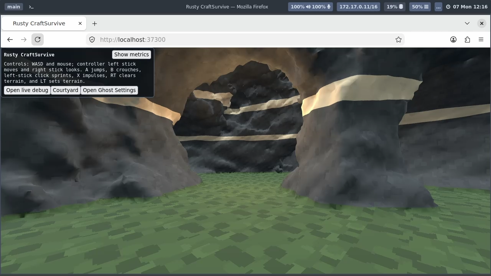
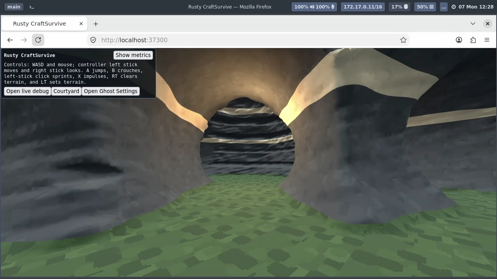

# Strongly disrupted caves — 2026-09-07

The Courtyard **Disrupted cave** study adds five independently seeded spectral
noise bands (15 octaves total), with roughly ten times the combined field-value
amplitude envelope of the initial weathered recipe. Broad lobes reshape the
chambers; smaller bands add recesses and roughness. This remains noise-driven
carving, not hydraulic erosion. The same room/route intent, flat floor, enclosure
and entrance remain; a narrow walking core is carved back after displacement.

Root inspected the GPU hub, left and goal views. Walls and openings are visibly
less regular, with deep recesses and bulges. The pale material strips remain
fairly ordered and the flat floor still reveals the authored walking layout.
This is a useful stronger shape experiment, not a final cave art direction.

| Disrupted, Normal | Triangles | Vertices | Generation seconds | Boundary / non-manifold / winding |
|---|---:|---:|---:|---|
| Seed 11 | 183158 | 142802 | 7.442 | 0 / 9 / 0 |
| Seed 29 | 232724 | 189235 | 7.976 | 0 / 18 / 0 |
| Seed 47 | 206684 | 166054 | 8.415 | 0 / 14 / 0 |
| Default seed 289142818388 | 200750 | 158420 | 7.785 | 0 / 6 / 0 |

All four passed 1008/1008 source-field route body witnesses. Zero boundary edges
is not a manifold, self-intersection or collision-traversal certificate. Engine
**#7870** tracks the non-manifold edges revealed by this stress recipe. No full
walking-route acceptance or frame-rate benchmark was performed this turn.

## Larger mesh capacity

The default-seed Normal disrupted cave initially failed the old 16 MiB encoded
mesh-definition admission. That cap was Engine policy on inline JSON, not a
Three.js or GPU limit. Engine **#7868** now aligns per-resource admission with
the renderer model's existing 64 MiB limit, and mesh preload/bundle/complete
baseline aggregates at 256 MiB. The safe SDK names the updated limits. Raw
copied streams and encoded inline JSON each have their own size check; numeric
JSON is larger than packed GPU buffers. Ordinary incremental delivery stays
at 16 MiB and larger retained changes use the existing baseline reconstruction.
Debug and timeline callbacks now share that reconstruction behavior.

The previously rejected default-seed cave succeeds with the new pair. The
previously rejected **Weathered strata / seed 11 / Fine** also succeeds:
297326 triangles, 195238 vertices, 19.664 seconds, clearance 1008/1008 and
raw topology 0/0/0. Root inspected its GPU hub capture. This proves admission
and visible delivery for that case, not acceptable frame pacing or arbitrary
mesh size. Partitioning remains useful future work for culling/streaming, not
a mandatory workaround for the old cap.

## Delivery and evidence

Current local contributor pair: SDK `0.1.0-dev.2574cc89fd30.waves3`, runtime
`runtime-pack-2574cc89fd30-waves6`. The first Normal screenshots used waves5;
geometry is identical. Fine screenshot and final readouts use waves6. Changes
remain in working trees with concurrent controller work preserved; no published
release or new CI result is claimed. Authoring uses `--debugger`; generation
remains synchronous and may exceed the ordinary callback deadline.

Passed: Release product build, DOM UI check, large native mesh admission test,
four publication-budget tests including a baseline above the old 64 MiB limit,
two fragmented-baseline delivery/recovery tests, Engine service/runtime Clippy,
and 90 browser-host tests including metadata admission/rejection boundaries.

`index.json` maps operator labels to original captures. The harness supplies
capture timestamps but no exact game-frame identity or measured freshness.
The event journal preserves action/capture/release receipts. No Moonlight logs
or installed configuration are copied. Warning capture is report-only, with no
compatible browser baseline; see the checkpoint files and final note below.

Final checkpoint: complete drain, 12 warnings, zero errors and zero dropped
diagnostic events. Six warnings concern dropped worker timing observations
(Engine #7833); six browser host transition warnings have recovered-baseline
evidence in the same checkpoint (Engine #7865). These do not certify a clean
browser-console delta or accurate runtime timing telemetry. The pre-upgrade
checkpoint additionally retains source-reload/rebind warnings under #7865.
The controller lease was released at 11:31:22 UTC with no cleanup errors;
post-release state had no lease, sessions or lobbies. Final live scene is
Disrupted cave / seed 11 / Normal / level-hub.
