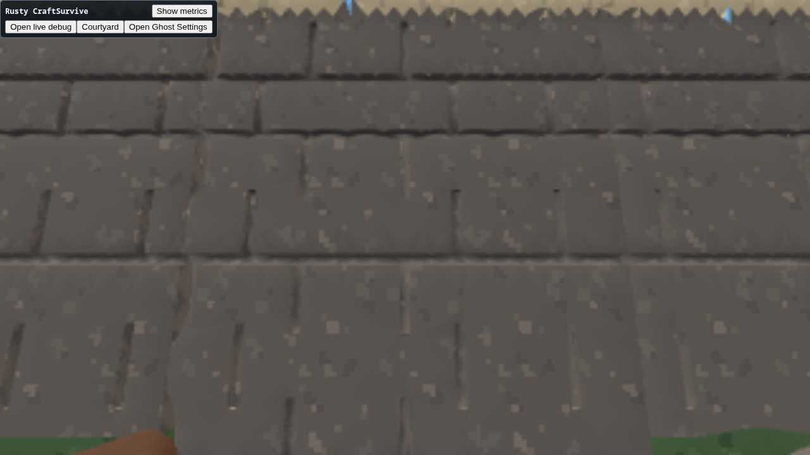
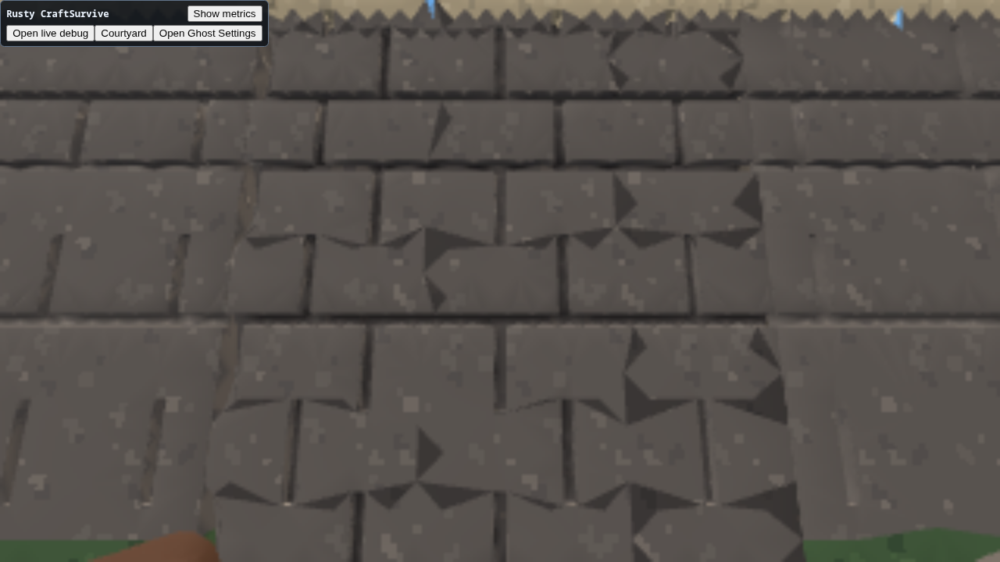
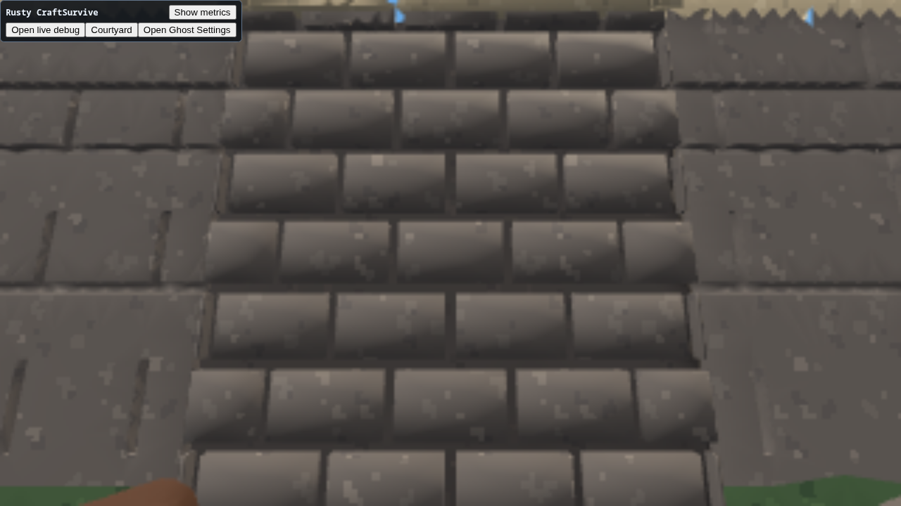
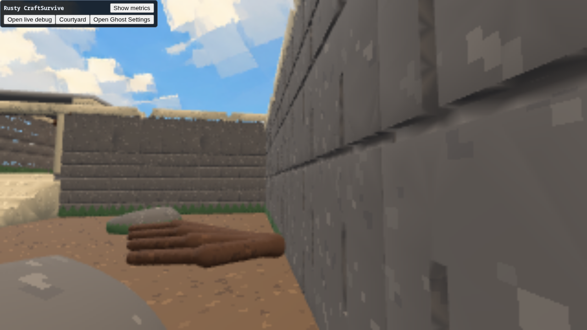
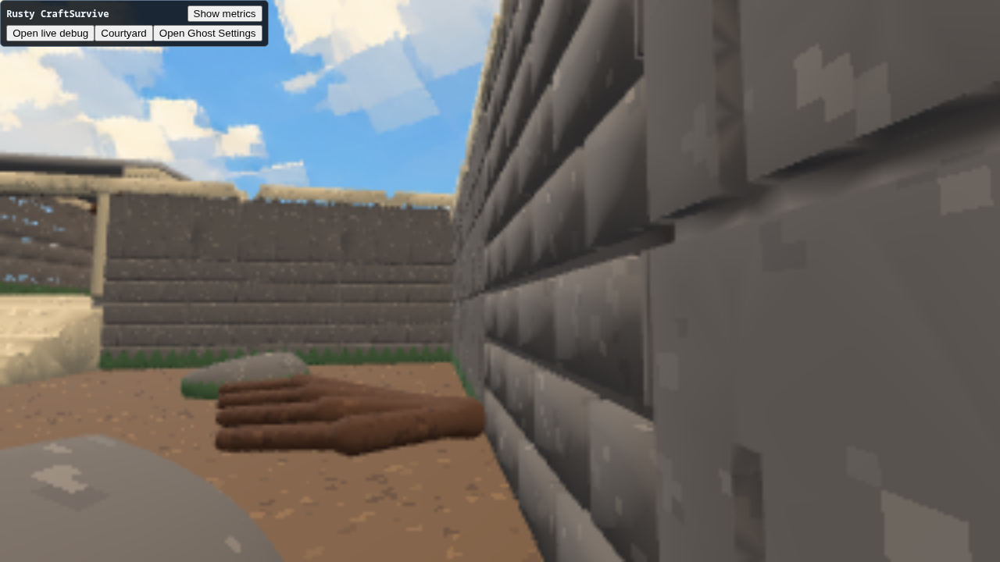
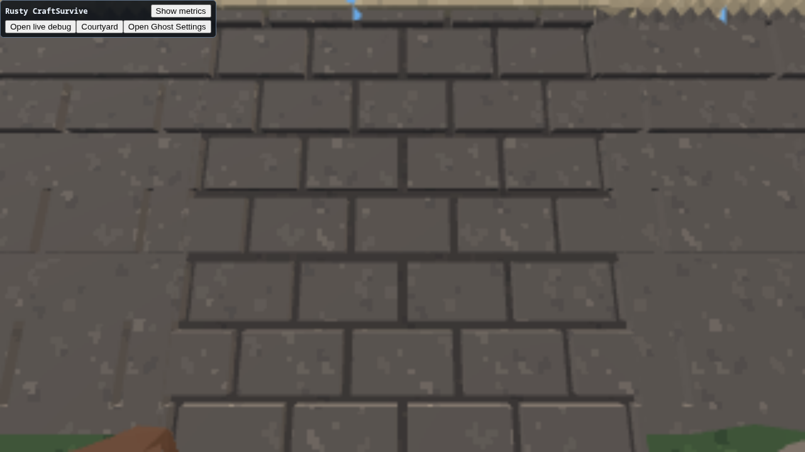
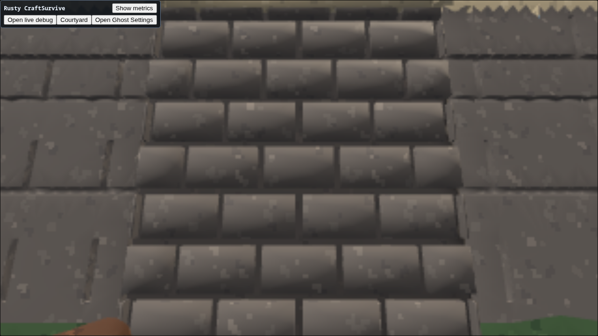
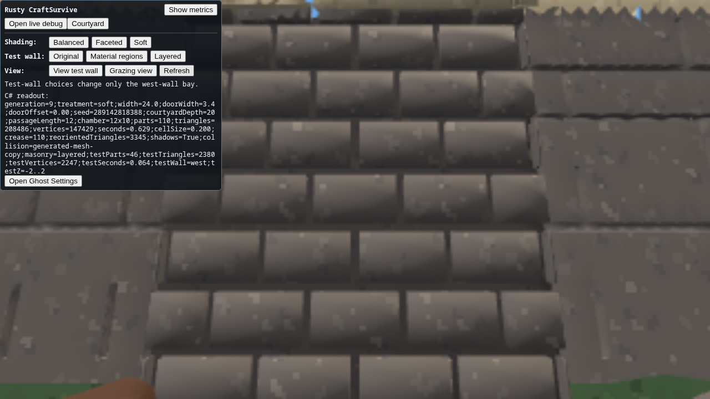

# Layered masonry test

The separate-brick construction gives this wall bay much clearer material
boundaries and relief than the unioned alternatives. It is a useful authoring
option on the existing Engine API, with a measurable draw-cost tradeoff.
This is the follow-up to the [courtyard experiment](courtyard-verdict.md), Den
#7841. The Engine SDK/runtime pair remains `b9740421c2d2`.

## Try it

Open **Courtyard → View test wall**. Compare **Original**, **Material regions**,
and **Layered**, then use **Grazing view**. Shading presets remain independent;
Soft + Layered is the default. Only the four-metre west-wall bay at z=-2..2
changes construction. **Refresh** reads the applied generation and bay costs.

Equivalent commands:

```text
craft.courtyard.masonry original
craft.courtyard.masonry regions
craft.courtyard.masonry layered
craft.courtyard.inspect front
craft.courtyard.inspect grazing
craft.courtyard.readout
```

Regeneration commands queue work for the next normal product update. An
inspection command positions the ordinary player/camera for comparison; it
is not evidence of physical traversal.

## What is compared

All three modes consume the same staggered brick bounds, backing, cap and
seeded chip subtraction. Courses are 0.60m high, bricks are nominally 0.95m long,
with 0.09m joints and 0.09m relief. Boundary bricks are clipped to the bay.
The unrelated moss classification is omitted in all three test modes.

- **Original:** one unioned field, stone wall and plaster cap.
- **Material regions:** the same unioned geometry, with mortar as the default
  material and brick boxes (expanded by 0.015m tolerance) selecting stone.
  Existing Engine material selection classifies triangles; it does not split
  triangles along the requested brick boundaries.
- **Layered:** 44 brick solids, a mortar backing solid and a cap, each
  DC-generated separately. Each mesh has a single material. Brick volumes
  overlap the backing, while exposed faces protrude from it; ordinary depth
  testing resolves visibility. There is no fixed draw ordering or depth bias.

C# owns this recipe and material choice. Engine ImplicitSurfaces still owns all
field evaluation and meshing, Graphics retains the results, and Spatial copies
those same generated meshes for collision. There is no downstream mesher,
hand-built triangle path, shader substitute or separate collision proxy.

## Visual result

| Original | Material regions | Layered |
| --- | --- | --- |
|  |  |  |
|  |  |  |

The original's shallow joints largely disappear at grazing angles. Material
regions add obvious triangular patches across brick faces without changing the
geometry. Layered bricks retain distinct faces and recessed mortar gaps from
both views, so this construction avoids that particular material-boundary
failure. It also preserves the relief better because each solid is sampled
independently in its own domain. This is a different extraction decomposition,
not just recolouring the original mesh.

Soft's 110-degree normals give individual bricks rounded-looking gradients;
Faceted keeps hard planes and also preserves the material boundaries:



The highly regular courses can look like stacked blocks or siding. An
independent Luna critic also preferred the layered readability but flagged this
regularity and soft gradients. These are aesthetic choices to tune, not a
reason to make upstream meshing retro-specific. The test does not resolve
existing holes/sawtooth caps elsewhere, guarantee arbitrary sub-cell features,
or prove watertight topology or flicker-free motion from still images.

## Measured tradeoff

Same Soft preset (requested 0.20m cells, 110-degree crease), default layout and
matched front view. Times are individual observations, not benchmark averages.

| Measurement | Original | Material regions | Layered |
| --- | ---: | ---: | ---: |
| Bay retained pieces | 1 | 1 | 46 |
| Bay triangles | 5,362 | 5,362 | 2,380 |
| Bay vertices | 4,188 | 4,188 | 2,247 |
| Bay construction seconds | 0.009 | 0.007 | 0.053 |
| Whole-scene construction seconds | 0.704 | 0.608 | 0.719 |
| Whole-scene retained pieces | 65 | 65 | 110 |
| Whole-view draw calls per submission | 56 | 58 | 98 |
| Whole-view submitted triangles | 111,410 | 111,410 | 103,066 |
| Live geometry resources | 68 | 68 | 113 |
| Live render handles | 72 | 72 | 117 |

For this bay, layered construction uses about 56% fewer triangles but 45 more
pieces and 42 more whole-view draw calls than Original. It is not automatically
a faster renderer. The extra per-piece generation costs about 44ms in these
samples; whole-scene generation remained around 0.6–0.8s. No batching framework
was added before establishing this cost. Combining compatible generated meshes
would be a separate reusable Engine capability if later scaling needs it.

Browser captures use software SwiftShader at 320×180 backing resolution in a
1280×720 viewport. Their low pacing is not a hardware performance estimate,
and the resolution limits fine texture and distant-joint judgments. Raw
readouts and renderer snapshots are in `docs/evidence/layered-masonry/`.

## Collision and regeneration

From the controlled front pose, physical W input stopped the standing capsule
at x=-10.995, matching the brick face at x=-11.31 plus its 0.315m radius.
The player remained grounded; the controller reported `blocked=Wall`. Physical
W+D then moved along the wall from z=0 to approximately -2.017 while x stayed
-10.995, including the edge of this bay. No camera positioning was used during
those input segments. This is a focused contact/slide check, not an exhaustive
collision test for overlapping meshes.

`craft.courtyard.layout 26 3.8 0.25 12345` regenerated in the same runtime:
112 scene parts, 212,778 triangles, 0.743s; the bay retained 46 parts with 1,854
triangles and 0.059s construction. The changed seed alters the chip subtraction.
Inspection followed the wall one metre west, moving its front eye from x=-8.4
to -9.4, and the layered bay remained readable:



The default layout was restored, then the reloaded DOM panel's ordinary
Original → Refresh → Layered → Refresh controls reached generation 9. It
returned to exactly 110 parts / 208,486 triangles / 147,429 vertices, with the
same 2,380-triangle bay. Live handles returned to their initial layered counts;
the comparison cycles did not accumulate retained geometry in these samples.
The front/grazing UI commands and readout were also exercised after width 26.



## Validation and evidence limits

Focused Release compilation, UI type checking, texture audit and diff checks
passed. A separate read-only audit found no new downstream Engine mechanism
substitute or consequential lifetime/collision recipe defect.

Playtest session:
`rusty-craftsurvive-playtest-20260906T072839.906296817Z-475237`.
Raw screenshots and the action timeline survive under the local playtester
run; selected unmodified frames, readouts, the original action/cleanup logs and
compact provenance are checked in alongside this result. Browser capture initially retained the previous ungrouped UI module
across a live restage; ordinary reload loaded the current grouped controls.
One click while pointer-locked required a forced attempt in the earlier pass;
the final reloaded pass used ordinary clicks. These are recorded limitations
of the observations, not hidden passes.

Report-only warning capture completed both browser and Engine channels at
cursor 18 with no lag or diagnostic loss. Its post-checkpoint window contained
one Chromium `ReadPixels` GPU-stall performance warning and no Engine events.
No baseline was supplied, so `cleanClaimEligible=false`; no clean warning delta
is claimed. The script's revision identifies the Engine checkout running the
capture, not the uncommitted product snapshot.

Full-session diagnostics preserve sequences 1–18: 14 warnings, zero Engine
errors, zero dropped diagnostics, `lagged=false`. Eight
`DEV_HOST_WORKER_TELEMETRY_DROPPED` warnings concern discarded timing samples,
not lost diagnostic events. Those and one recovered same-runtime browser
baseline transition remain the known Engine #7833 publication-pressure limit.
During the intentional UI restage before the matched comparisons, one debug
request received HTTP 500 `DEV_HOST_WORKER_REPLACING`, accompanied by a
recoverable `CSHARP_CONTROL_BINDING` warning and browser reattachment. The
subsequent ready state names the new binding; repeated commands and physical
input succeeded. That setup interruption is recorded under this test (#7841),
not treated as a successful request or an unexplained error. The browser also
recorded four initial driver stall warnings and no page exceptions.

The recorder truncated its final `playtest-index.json` to zero bytes during
finish, despite returning a pass. A post-finish report could not restore it.
This infrastructure failure is Den Services #7842. The surviving original
`timeline.jsonl` records the actions, observations, finish verdict and browser
cleanup; `host-cleanup.jsonl` confirms the server stopped and records the index
parse failure. `provenance.json` explicitly identifies this loss; it is not a
replacement canonical index. The separate Engine warning capture was already
complete and its file remains intact.

The practical verdict is **keep Layered as the test-bay default and an available
construction technique**. It improves material separation and relief at modest
construction cost in this scene. Scaling its piece/draw count and tuning its
regularity are separate decisions; the wider courtyard remains a useful control
for the unresolved unioned-mesh artifacts.
