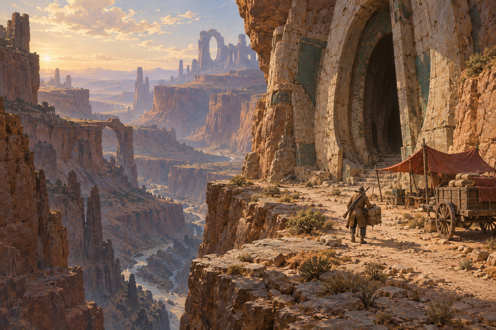
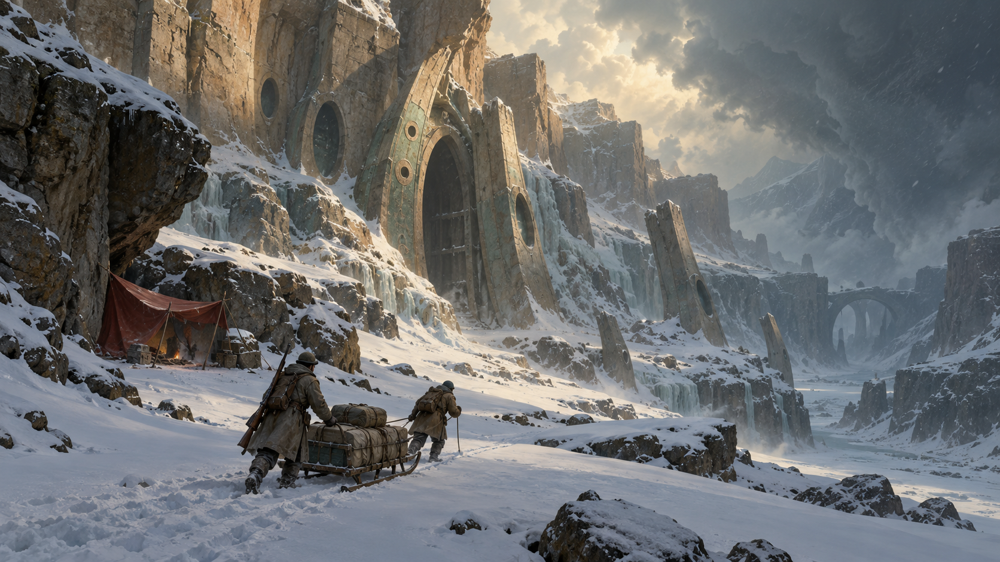
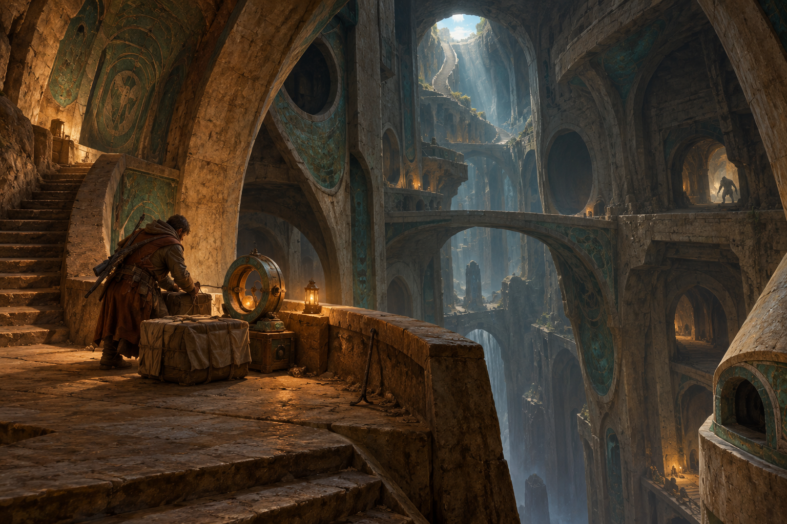
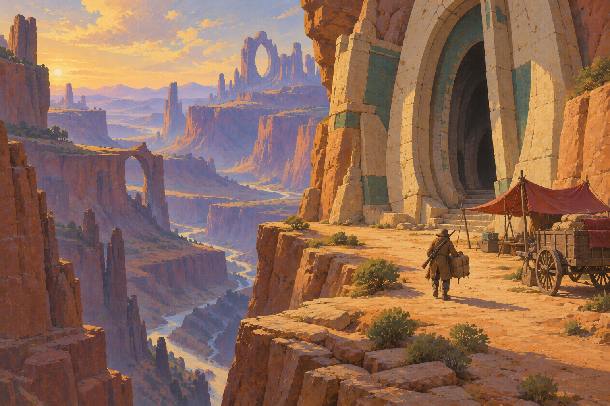

# Paperback Sanctum style references

All four images are approved positive references for CraftSurvive's visual
direction. The more detailed studies and the broader painted canyon belong to
the accepted range; neither treatment supersedes the other.

Use them with the [visual direction guide](../../visual-direction.md). The
[exact generation prompts](prompts.md) and the owner's unmodified
[source style prompt](source-style.md) are retained alongside the original PNGs.
These are GPT-generated concept illustrations, not Engine screenshots or
production assets. Their architectural vocabulary guides design without fixing
every depicted object as lore or promising a particular gameplay mechanic.

## Canyon arrival

Expansive layered terrain, warm stone and cool distance, a monumental entrance
embedded in the cliff, and a small practical shelter and loaded transport.

## Tundra expedition

Severe weather, quiet snow surfaces, worn ancient structures, and visible hauling
effort. Scale and atmosphere retain beauty in a harsh environment.

## Dungeon extraction

Vertical depth, readable connecting structures, restrained warm light against
cool distance, and a tangible working area for recovering cargo.

## Painted canyon

The canyon composition with broader painted color, quieter surface detail, and
more explicit illustration character. A companion treatment to the original.

