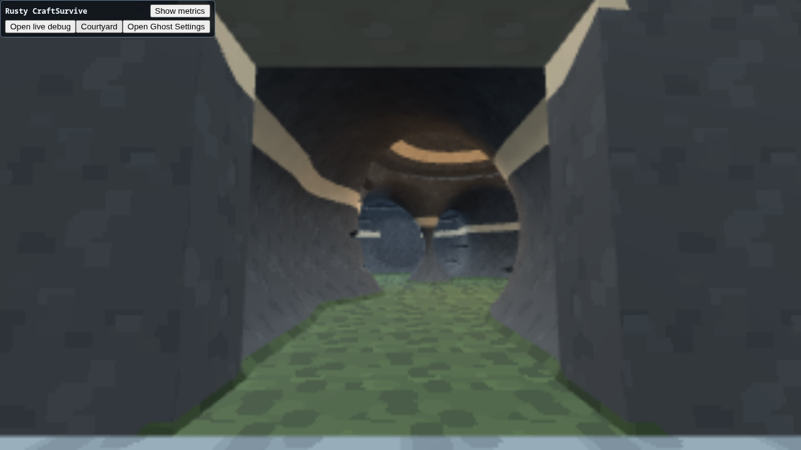
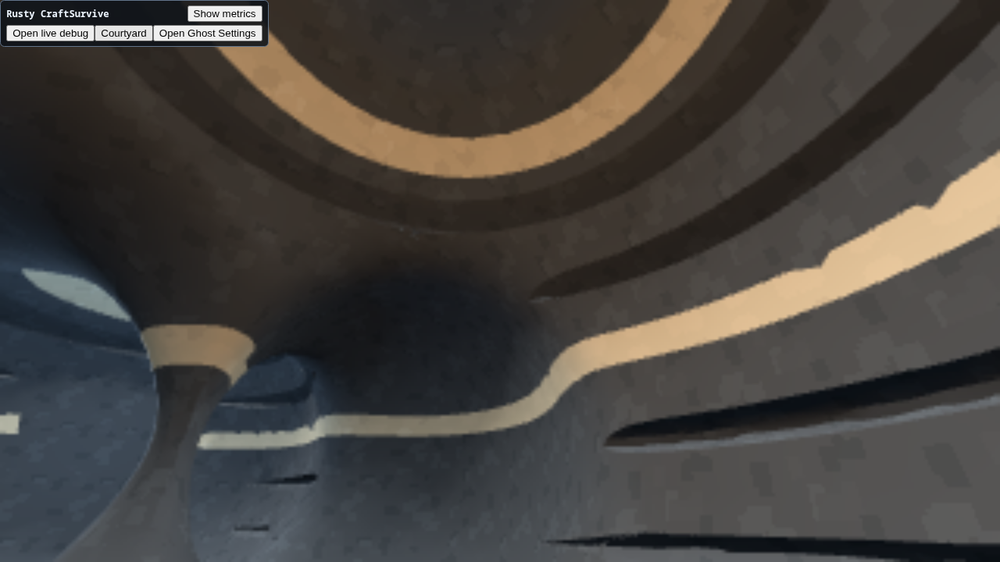

# Volume-first carved cave

CraftSurvive #7859 tests a single bounded rock volume with connected air carved
out of it. Courtyard → **Carve passages**, **Add chambers**, and **Carved volume**
show successive stages. Volume views provide **Entry**, **Chamber**, **Back room**,
and **Outer shell**. Coarse / Normal / Fine change the whole volume's extraction
spacing (requested 0.50 / 0.28 / 0.16 m); the generation readout reports actual
spacing and mesh counts. Earlier cave and detail studies remain available.

`VolumeCaveRecipe` owns the level recipe. In negative-inside field notation:

```
rock = outerBox - ((connectedCarves ∩ protectedInterior) ∪ entrance)
```

The outer box is 24 × 14 × 30 m. All internal carving is clipped at least 1.2 m
from the sides, rear, and roof; the flat walkable floor retains 3 m of rock. The
only carve bypassing that margin is a 4 m wide front entrance. One generated
mesh contains the exterior, interior, floor, roof, and entrance rim. A separate
approach landing ends at the front face and does not conceal the interior floor.
The spatial collider uses the same Engine-generated mesh resource.

Passages use connected capsules, chambers enlarge that air with ellipsoids,
and the final stage adds lateral strata recesses and a higher ceiling pocket.
This is a bounded staged carving experiment, **not hydraulic erosion**. The seed
makes small deterministic bends, rather than generating a wholly new layout.
The inherited `craft.courtyard.layout 24 3.4 0 <seed>` debug command can vary it;
width and door controls belong to the older courtyard and do not resize this
experiment. Material bands color the same rock mesh; no internal wall props or
separate room shells supply its enclosure.

## Reuse and diagnostics

Current rusty-procgen (`c9ee6bb`) supplies graph validation, 2D layout/routing,
and workload cellular automata, but no physical cave carving or erosion module.
This recipe adapts its explicit stages, seed, and bounded-layout approach; it
does not import its application framework or resurrect historical extrusion.
The projects remain separate. Graph-selected room and passage intent could
feed this field realization later without changing Engine ownership.

Engine #7860 adds general boundary-edge, non-manifold-edge, and inconsistent-
winding-edge counts to the existing implicit generation readout. They describe
extracted index topology **before** normal/UV/material splitting. A cave entrance
is an opening in the air space; the surrounding rock surface can remain closed.
Zero counters do not establish freedom from self-intersections or prove final
material-clipped triangle connectivity.

The recipe also samples the actual Engine field at 19 retained-shell witnesses
and 26 entrance/path witnesses. The readout reports the passing counts. The
wall-margin guarantee comes from clipping construction; these finite samples
are witnesses, not an exhaustive voxel flood fill or a second field evaluator.

Current runtime/SDK pair: `6a386f3a6b873547e405b199bc7241f32e40f329`.

## Observed result

The single rock mesh generated successfully at Coarse (15,064 triangles,
10,540 vertices, actual spacing 0.47656 m), Normal (34,716 triangles,
22,810 vertices, actual spacing 0.23828 m) and Fine (70,526 triangles,
42,820 vertices, actual spacing 0.11914 m). All three reported zero extracted boundary,
non-manifold, and inconsistent-winding edges, with all 19/19 shell and 26/26 air
witnesses passing. The separate landing adds 12 triangles / 24 vertices.
Generation is a local observation, not a representative game performance benchmark.

The entry and chamber captures show continuous walls and ceiling, with rounded
passage joins and layered lateral recesses. Pale material bands are deliberately
legible but currently read more like graphic stripes than natural mineral seams.
That is an authoring adjustment, not evidence of a separate room-shell technique.

Captured evidence is under [evidence/volume-carved-cave](evidence/volume-carved-cave).
The warning capture completed with one software-capture GPU `ReadPixels` stall
warning, linked to Den Services #7853. No compatible warning baseline was supplied,
so comparison is unavailable. The retained Engine diagnostic read had no warnings,
errors, drops, or lag; this is not an absolute warning-free claim.




The dedicated playtest captured all four views and each stage, walked through
the entrance with canvas focus/pointer lock, and exercised bounded wall contact.
This is a short traversal check, not exhaustive collision certification.
The session ended with pass status. The final broker record confirms browser,
test-server, and display cleanup, but records `driver_stopped=false`; an earlier
driver response and agent summary had reported true. The test listener on 37100
is gone. The separate LAN service on 37300 was restored and returned HTTP 200
with the applied volume readout; see `lan-readback.json`.
Synthetic pointer-lock exit assistance and sequence-missing advisory records
remain in the source index; they are not hidden as product correctness evidence.
