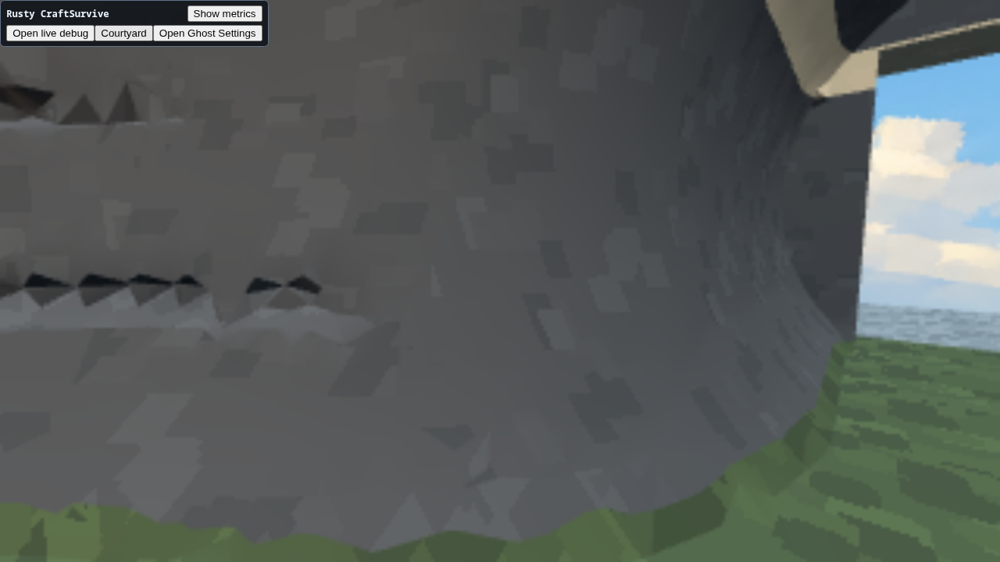
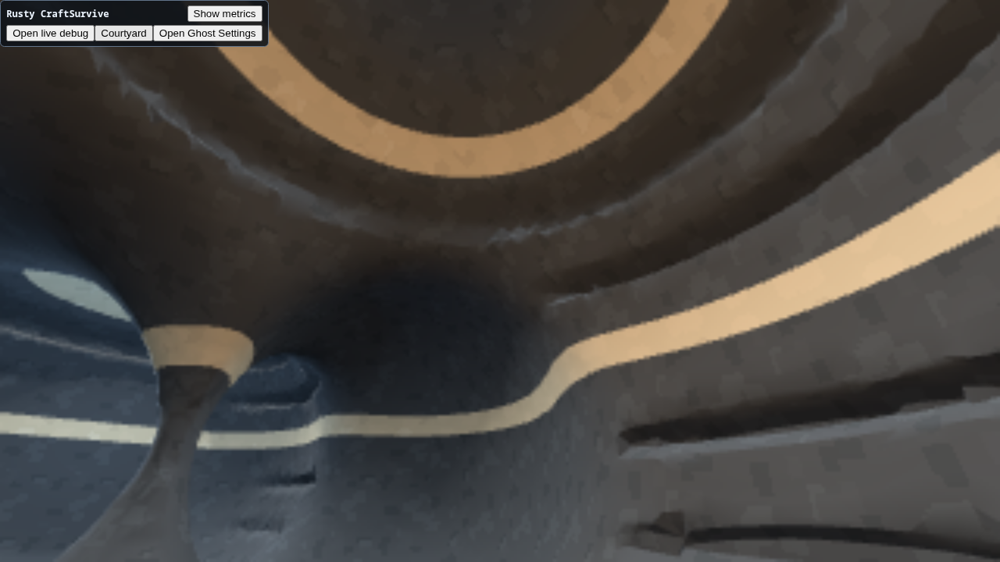

# Reusable voxel foundation

Engine #7861 and CraftSurvive #7862 move the shared authoring vocabulary into
`Rusty.Engine.Implicit` and add retained sampled densities to the Engine's
`ImplicitSurfaces` service. CraftSurvive owns its designs, materials, seed,
lighting, study settings, and scene replacement. Its local recipe framework and
wall implementation have been removed; the existing studies consume the SDK.

The volume recipe now uses Engine passage, chamber, join, and enclosure helpers.
Its artistic lateral cuts and level layout remain product choices. **Carved
volume** uses the adaptive analytic path. **Sampled volume** rasterizes the same
field to an Engine-owned density lattice, then extracts through the existing
uniform DC mesher. The source volume is disposed after synchronous generation;
the ordinary mesh resource and copied collider remain retained. No alternate
renderer, evaluator, or C# density storage was added.

Sampled Coarse / Normal / Fine use 0.60 / 0.40 / 0.25 m spacing, respectively.
The entire lattice includes exterior air around the rock shell. Analytic detail
settings retain their previous requested 0.50 / 0.28 / 0.16 m spacing. The readout
identifies the source, actual grid dimensions/spacing/revision, output counts,
and extracted edge diagnostics. These are different sampling strategies, not
an equal-cost or equal-resolution benchmark.

**Cut left** and **Cut right** provide supported-floor views of the shallow
recesses that previously showed protruding folds. The Engine now recovers
adaptive QEF solutions that escape their finest cell to the mean of that cell's
Hermite crossings, without allowing the invalid solution to drive collapse.
`boundedLeafVertices` exposes those recoveries. A carved-cave regression reduced
maximum absolute field residual from 0.25767 to 0.04311 while retaining zero
extracted edge defects. Field residual is not Euclidean distance.

The sampled backend still places one vertex per active cell. Thin structures
can alias: the alternate-seed native fixture at 0.4 m reports one non-manifold
edge, with no boundary or inconsistent-winding edges. This limitation stays
visible rather than being described as a general manifold guarantee. Neither
backend promises arbitrary feature survival or self-intersection-free output.
Material refinement improves region sampling but cannot restore lost geometry.

There is no erosion simulation, world streaming expansion, or performance
optimization campaign in this change. Retained read/write/rasterize/sample/mesh
operations are the upstream foundation for later experiments.

## Verification and limits

The installed pair is Engine `2207cc4e98422c036b655742651f08e102a22ab4`.
The packaged Release product build, DOM UI check, and phased/rotated recipe tests
against the actual SDK pass. Upstream focused tests cover scalar magnitudes,
coordinates, sample copies/leases, mutation invalidation, rasterization lifetime,
extraction, and the carved geometry regression; strict Clippy and the required
Engine CI checks pass.

The dedicated live session captured both cut perspectives. The large projecting
wedges are removed; small triangular notches remain along shallow recess edges.
Software backing resolution is 320×180, so these captures cannot certify tiny
feature quality. They complement geometric diagnostics rather than replace them.

The warning script completed with no findings during its capture window and no
compatible baseline (report-only). A subsequent full Engine read found one
`DEV_HOST_WORKER_TELEMETRY_DROPPED` warning: a timing observation could not enter
the bounded shell publication queue. It did not drop retained scene state or
break the runtime; diagnostic capture has zero drops/lag and zero errors. This
existing publication/telemetry issue is tracked by **Engine #7833**. It is not
hidden behind a warning-free claim, and performance work remains deferred.
The playtest browser also records four software-capture `ReadPixels` GPU-stall
warnings, linked to Den Services #7853. These predate the warning script's short
capture window and remain in the preserved browser-console evidence.

Live totals (rock plus the 12-triangle landing), Balanced shading:

| Source | Detail | Grid | Triangles | Vertices | Boundary / non-manifold / winding edges |
| --- | --- | --- | ---: | ---: | --- |
| Analytic | Normal | adaptive | 35,542 | 25,474 | 0 / 0 / 0 |
| Sampled | Normal | 64 × 39 × 79 | 61,898 | 35,936 | 0 / 2 / 0 |
| Sampled | Fine | 101 × 61 × 125 | 152,310 | 85,297 | 0 / 1 / 0 |

All generated successfully with 19/19 shell and 26/26 analytic-field witnesses.
Those witnesses describe the source construction, not an exhaustive sampled-grid
connectivity proof. The sampled path is useful for retained editable scalar data;
the adaptive analytic path remains the cheaper default for this recipe.

The bounded W input burst had canvas focus and completed key release; its frame
displacement was too subtle to establish entrance traversal distance. Captures
showed the floor and passage walls, but this is not a collision certification.
One unsupported harness action and sequence advisories are retained. Pointer-lock
exit used explicit `document.exitPointerLock()` assistance, then the study was
restored to Carved volume / Normal / Entry.

Evidence: [capture map](evidence/voxel-foundation/capture-map.json),
[final readout](evidence/voxel-foundation/final-analytic-normal-readout.txt),
[Engine diagnostics](evidence/voxel-foundation/runtime-diagnostics.json).

The finalized broker index confirms browser, test server, and virtual-display
cleanup. It records `driver_stopped=false`, despite the agent's cleanup summary
reporting true; the test listener is gone. The indexed value is preserved in
[the session summary](evidence/voxel-foundation/session-summary.json).
